# V7 TinyML Vehicle Detector - Implementation Flow

## Diagram 1: Overall Pipeline (High-Level)

---

## Diagram 2: Phase 1 - Data Collection

```mermaid
flowchart TD
    Start([Distiller_YOLO_V7.py]) --> Download[Download 11 YouTube Videos<br/>720p Traffic Footage]
    Download --> Teacher[Load YOLOv8n Teacher Model<br/>COCO Pretrained]
    Teacher --> Sample[Sample Frames<br/>Every 30 frames]
    Sample --> Label[Auto-Label Vehicles<br/>Confidence ≥ 0.4]
    Label --> Convert[Convert to YOLO Format<br/>Normalized Coordinates]
    Convert --> Split[Split 80/20<br/>Train/Validation]
    Split --> Save[Save Dataset<br/>dataset_yolo/]
    Save --> YAML[Generate v7_data.yaml]
    YAML --> End([Dataset Ready])
    
    style Start fill:#e1f5ff,stroke:#01579b,stroke-width:2px,color:#000
    style End fill:#c8e6c9,stroke:#2e7d32,stroke-width:2px,color:#000
```

---

## Diagram 3: Phase 2 - Model Training

---

## Diagram 4: Phase 3 - Model Export

---

## Diagram 5: Phase 4 - Live Inference

